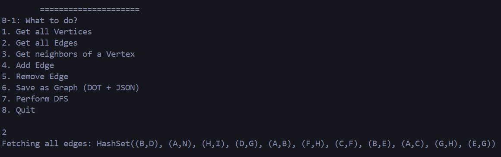
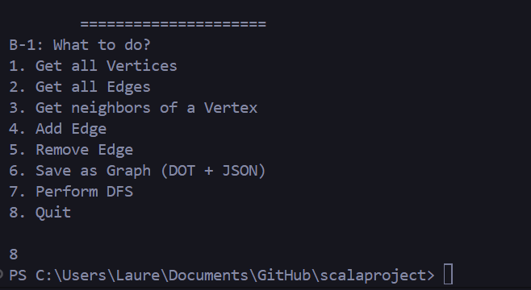

# Funtional Programming Project (Scala 3)

## Project Overview

This project is a terminal-based application that allows users to create, edit, and save directed graphs in DOT format. The application is written in Scala 3 and uses the ZIO library for effect management. The application is designed to be simple and easy to use, with a focus on functional programming principles.

The project is divided into two sub-projects:

1. **Graph Data Structure**: The project includes a graph data structure library with various operations for creating, editing, and saving directed graphs, undirected graphs and weighted directed graphs. It also includes graph operations such as DFS, BFS, Topological Sort, Cycle Detection and Dijkstra Algorithm.

2. **ZIO Application Integration**: The graph data structure library is integrated into a ZIO application that provides a terminal-based interface for users to interact with the graph data structure. 
**Currently, the app only support directed graphs**, but it can be easily extended to support other types of graphs.

## Pre-requisites

- Scala 3
- SBT
- Java 11 or higher

## Instructions

To run the application, you will need to have SBT installed on your machine. You can run the application by executing the following command in the root directory of the project:

```bash
sbt run
```

This will start the application in the terminal. You can then follow the on-screen instructions to create, edit, and save directed graphs. The application supports the following operations:

- Create a new graph from nothing
- Load an existing graph from a file (DOT format or JSON format)
- Add edges to the graph
- Remove edges from the graph
- List all vertices in the graph
- List all edges in the graph
- List neighbors of a specific vertex
- Save the graph to a file (DOT format or JSON format)
- Run graph algorithms (Only DFS for now in the terminal, to check other algorithms you can check the tests)
- Exit the application

You can also run the test and build the project by executing the following commands:

```bash
sbt test #to run the tests
sbt compile #to compile the project
```

## Design Decisions

### Graph Data Structure

The graph data structure library is designed to be simple and easy to use. It includes three types of graphs: directed graphs, undirected graphs, and weighted directed graphs. Each graph type has its own implementation with specific operations.

The graph data structure is implemented using an adjacency list representation, which is a common representation for graphs along with the adjacency matrix. The adjacency list is a map that maps each vertex to a list of its neighbors. This representation allows for efficient access to the neighbors of a vertex and is suitable for most graph operations. Compared to an adjacency matrix, the adjacency list is faster and uses less memory for sparse graphs where the number of edges is much smaller than the number of possible edges.

For the design of the graph data structure, we have followed functional programming principles such as immutability. The graph data structure is designed to be immutable, meaning that once a graph is created, it cannot be modified. Instead, operations on the graph return a new graph with the desired changes.

We have also implemented graph algorithms such as DFS, BFS, Topological Sort, Cycle Detection and Dijkstra Algorithm. These algorithms are commonly used in graph theory and provide useful insights into the structure of a graph. 
For now, theses algorithms have been implemented and tested to work on directed graphs.

#### Graph Classes and Traits 

The graph data structure library includes the following classes and traits:

- `Graph`: A trait that represents a generic graph. It defines common operations such as adding and removing edges, getting neighbors of a vertex, list all vertices and edges and show the dot format of the graph.

- `DirectedGraph`: A class that extends the `Graph` trait for directed graphs. It uses an adjacency list representation to store the graph data.

- `UndirectedGraph`: A class that extends the `Graph` trait for undirected graphs. It uses an adjacency list representation similar to the directed graph.

- `WeightedGraph`: A class that extends the `Graph` trait for weighted directed graphs. It uses also uses an adjacency list representation and a weigthed edge class to store the weight of the edges.

All of theses classes extends the Graph trait because they share common operations such as adding and removing edges, getting neighbors of a vertex, etc ...
They also handle generic types, so the user can choose the type of the vertices (String, Int, etc ...).

Each graph have an object companion that contains the apply method to create a new empty graph and the encode and decode methods to save and load the graph in JSON format.

#### Graph Operations

For the implementation of the graph operations, we chose to create an object for each operation, and to create inside of it a function that would realize the operation. Indeed, we chose to organize our code that way since the objects are static, and to use the functions we don't need to instantiate them we can directly call the function from the object.

We decided to do all the functions using @tailrec, since without it, each recursive call would add a new frame to the call stack. Instead, here it uses the current stack frame, which allows us to avoid getting a StackOverflowError that would occur if there was too many frames added to the call stack. Tail-recursive function could be optimized by the Scala compiler, which would make them faster and less memory consumming. 

We did DFS, BFS and DetectCycle  on directed graphs, and Dijkstra on weighted ones. Floyd-Marshall and Topological Sorting are not implemented yet.

- `DFS`: The `dfs` tailrec function takes in entry a graph and the stating point from which it'll start applying the DFS, and returns a Set of all the visted vertices. We use inside of it a pattern matching to process the stack.

- `BFS`: The tailrec `bfs` takes the same entries as DFS and returns the same thing, it also uses a pattern matching but it uses a queue and not a stack.

- `DetectCycle`: The tailrec function `hasCycle` also takes the same entries, but returns a boolean this time, whether the Graph contains a cycle or not. It uses DFS and checks if a vertex is already in the recursion stack.

- `Dijkstra` : The `dijkstra` function takes as entries a strating vertex and a map containing as keys the vertices, and as values a list of tuples which are the adjacent verteices and the weight of the edge to the vertices as keys. It returns the shortest path from a vertex to all other vertices in a weighted graph. We used a mutable map that keeps track of the shortest known distance from the source to each vertex, and a mutable priority queue to fetch the vertex with the smallest distance (the smallest distance having the highest priority).

#### State Management 
The state management is done with the ZIO library. ZIO enforces the immutability of the code, in line with the functional programming principles. In order to reduce side effects, we avoided the variable reassignment and instead used Immutable states. These cannot be altered after creation, and changes must be made by creating a new state. The core of the project revolves around the `DirectedGraph` state, which represents the current graph structure. It should be updated even though being immutable.

ZIO has a special state `Ref`, that can hold the DirectedGraph changes in a way that both provide functionnal purity and thread-safety (in case the app is operated with multiple concurrent users). 

```scala
directedGraphRef <- Ref.make(DirectedGraph[String]())
```
The application has many interactions for changing it, as it allows to import either DOT or JSON file at a location specified by the user directly in the terminal. The other interactions are diretly done by the user, who can add or remove edges, and all of them have input prompt that highlight these operations. 

Through the menu, ZIO uses combinators to handle possible human failures such as removing non-existent edges, invalid input keys, or writing a faulty import path. The error is handled so that the system is still running instead of crashing.

When satisfied, the user can save the `DirectedGraph` data, and it will persists in DOT and JSON format, that can be edited later.

#### Future possible improvements
We can still to upscale the current environment with dedicated alternatives such as : 
- Dedicated Database : We can think about storing graphs to a SQLite database (or similar) so that we have a centralized persistent graphs data where the user can query for specific ones.
- Graphic User Interface : Instead of an app terminal, we could try to go on API-based type, where the user will be entering a web server. This can enhance user experience with a cleaner user-friendly interface and providing a better state monitoring that can be easily customized.


## Testing

The project includes unit tests for the graph data structure library. The tests cover various scenarios for creating, editing, and saving directed, undirected, and weighted graphs and also for the graph algorithms.
The tests are written using the ScalaTest library and can be run using the `sbt test` command.

### Overview of Tests

Here's an overview of the test coverage for each type of graph and algorithms:

#### Common Graph Tests:

- **Initialization**: Confirms that a new graph starts empty with no vertices or edges.

- **Edge Management**: Verifies the correct addition and removal of edges, ensuring the integrity of the graph structure. For weighted graphs, this includes verifying the weights of the edges.

- **Neighbor Retrieval**: Ensures that the neighbors method returns the correct neighbors for each vertex. For directed and weighted graphs, this involves outgoing neighbors, while for undirected graphs, this includes both directions.

- **Vertex Filtering**: Checks that isolated vertices with empty edge sets are correctly filtered out.

- **Serialization/Deserialization**: Validates the correct serialization to JSON and deserialization from JSON, including error handling for invalid JSON.

- **DOT Format Serialization**: Ensures that the graph can be correctly serialized to the DOT format, suitable for visualization tools like Graphviz.

#### DirectedGraph Specific Tests:

- **Directed Edges**: Ensures that edges are correctly directed from one vertex to another and not bidirectional unless specified otherwise.

#### UndirectedGraph Specific Tests:

- **Bidirectional Edges**: Verifies that edges are correctly treated as bidirectional, with neighbors accessible from both vertices involved in the edge.

#### WeightedGraph Specific Tests:

- **Edge Weights**: Confirms that edges include weights and these weights are correctly handled during edge manipulations and neighbor retrieval.


#### Graph Algorithms Tests:

#### DFS and BFS Tests:

- **Connected graph**: Checks if it visits all vertices in a connected graph.

- **Cycle**: Checks if a graph with a cycle get handled well, meaning that it does not enter an infinite loop, but identifies that it has already passed by that vertex.

- **Disconnected graph**: Checks if it recognizes that a disconnected graph can't get through all vertices, and the outcome depends on the starting vertex.

- **One vertex**: It returns only the starting vertex if it has no neighbors.

- **Unexisting starting vertex**: Return an empty set if the given starting vertex does not exist in the graph.

- **Empty graph**: Returns an empty set for an empty graph.

#### DetectCycle Tests:

- **Has a cycle**: Detect a cycle in a cyclic graph.

- **Has many cycles**: Detect all cycles if a graph contains many.

- **No cycle**: Return false since there is no cycle.

- **Disconnected graph**: Detect cycles in the right component.

- **Empty graph**: Return false.

- **Unexisting starting vertex**: Return false for a graph where the start vertex does not exist.

#### Dijkstra Tests:

- **Shortest path**: Compute shortest path for a simple graph.

- **Single vertex**: Handles a graph with a single vertex.

- **Disconnected graph**: Handles it the right way.

- **No edges**: Handle a graph with no edges.

- **Multiple short paths**: Ensures that if there are lany shortest paths, it computes all of them.

- **Large graph**: To be able to handle a large graph.

- **Negative weights**: Recognizes that it can not operate on negative values.

- **Has a cycle**: Is able to handle cyclic graphs correctly.

## Usage Example

Here's an example of how to use the application:

### Start the Application

To start the application, run the following command in the root directory of the project:

```bash
sbt run
```

This will start the application in the terminal.

### Create a New Graph from a DOT File

To create a new graph from a DOT file, select the option to use an existing graph and enter the path to the DOT file when prompted. 

For example, to create a new graph from the `graph.dot` file in the graphsResults folder, enter the following path:

```bash
app/src/main/scala/fr/efrei/scalaproject/graphsResults/graph.dot
```

The graph will be loaded from the file, and you can then perform operations on it.


### Add Edges to the Graph

To add edges to the graph, select the option 4 to add edges and enter the vertices for the edge when prompted.
The edge will be added to the graph, and you can continue adding more edges.


### List All Vertices in the Graph

To list all vertices in the graph, select the option 1 to list all vertices. The vertices will be displayed on the screen.


### List All Edges in the Graph

To list all edges in the graph, select the option 2 to list all edges. The edges will be displayed on the screen.



### Remove Edges from the Graph and check if it's still there

To remove edges from the graph, select the option 5 to remove edges and enter the vertices for the edge when prompted.
The edge will be removed from the graph, then you can check if it's still there using the option 2.


### Apply DFS Algorithm

To apply the DFS algorithm to the graph, select the option 7 to run the DFS algorithm. The algorithm will be applied to the graph, and the result will be displayed on the screen.


### Save the Graph to a DOT and JSON File

To save the graph to a DOT and JSON file, select the option 6 to save the graph.
The graph will be saved in the graphsResults folder in the app project directory.


### Exit the Application

To exit the application, select the option 8 to exit the application.


